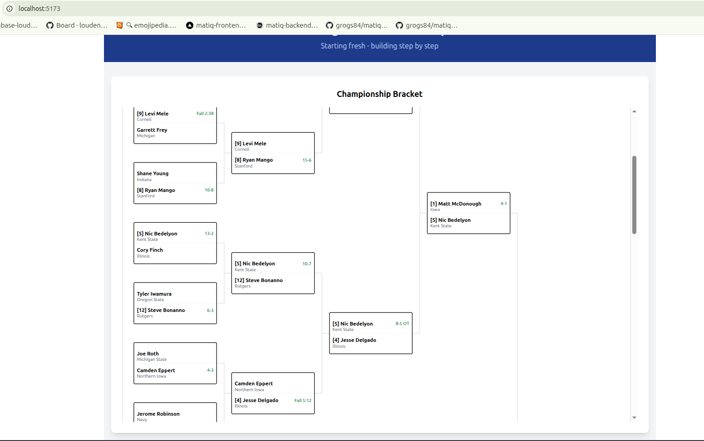
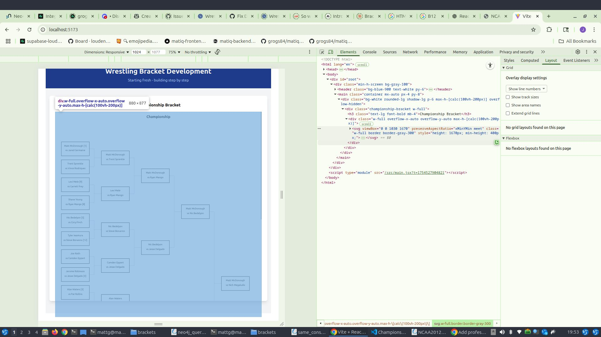

# Wrestling Bracket Visualization

Interactive NCAA D1 wrestling tournament bracket visualization built with React + Vite and Tailwind CSS following a **component-first design approach**.

## Project Overview

This application visualizes NCAA D1 wrestling tournament brackets with complex double elimination structures. Wrestling tournaments have unique flow patterns where losers from the championship bracket enter the consolation bracket at specific positions, creating non-linear tournament flows.

The project follows **incremental development** with a focus on building reusable wrestling bracket components that work with both PostgreSQL (normalized) and Neo4j (embedded) data structures.

## Current Features ✅

- **ChampionshipBracket Component**: Complete SVG-based championship bracket rendering
- **Flat Database Structure**: Database-agnostic tournament tree traversal using winner_next_match_id pointers
- **"Box Pattern" Connecting Lines**: Wrestling-style bracket lines with proper multi-segment connections
- **Enhanced Match Cards**: Wrestler names, seeds, schools, and winner-based scoring display
- **Responsive SVG Layout**: Tournament tree positioning with proper spacing algorithms
- **Embedded Data Approach**: Components expect complete participant data (no external references)
- **Tournament Tree Algorithm**: Handles 8, 16, and 32-wrestler championship brackets

## Technical Stack

- **Frontend**: React 18 + Vite
- **Styling**: Tailwind CSS utility-first approach
- **Rendering**: SVG-based bracket visualization with mathematical positioning
- **Data**: Database-agnostic flat structure (works with PostgreSQL/Neo4j)
- **Component Library**: Clean exports/imports following modern React patterns

## Screenshots

### Championship Bracket - Current Implementation (August 2025)


*32-wrestler championship bracket with enhanced match cards and winner-based scoring*

### Previous Implementation


*Earlier version for comparison*

The current implementation shows:
- **Left-aligned seeds**: [1], [2] format before wrestler names with same font styling
- **Winner-based scoring**: Scores appear inline with winner's name (Fall times, decision scores)  
- **School display**: University names below wrestler names in smaller gray text
- **"Box pattern" connecting lines**: Multi-segment lines following wrestling bracket conventions
- **Tournament tree positioning**: Proper mathematical spacing between rounds
- **Interactive matches**: Optional click handlers for match details
- **Responsive SVG layout**: Scales properly across different screen sizes

### Match Card Layout Enhancement

**Current Layout (✅)**:
```
[1] Matt McDonough        Fall 3:24
    Iowa

    Jared Germaine
    Penn State
```

**Previous Layout**:
```
Matt McDonough                    1
Iowa
Jared Germaine                    
Penn State
            Fall 3:24
```

## Development

### Prerequisites

- Node.js (v18+ recommended)
- npm

### Getting Started

1. Install dependencies:
   ```bash
   npm install
   ```

2. Start the development server:
   ```bash
   npm run dev
   ```

2. Start the development server:
   ```bash
   npm run dev
   ```

3. Open [http://localhost:5174](http://localhost:5174) to view the application

### Available Scripts

- `npm run dev` - Start development server
- `npm run build` - Build for production
- `npm run preview` - Preview production build
- `npm run lint` - Run ESLint

### Component Development

The ChampionshipBracket component follows **pure component** design principles:

```javascript
// ChampionshipBracket usage
import ChampionshipBracket from './components/ChampionshipBracket'

<ChampionshipBracket 
  matches={sampleMatches}
  onMatchClick={handleMatchClick}  // Optional click handler
/>
```

## Data Structure - Embedded Participant Approach

Components expect matches with **embedded participant data** (not separate arrays):

```javascript
const match = {
  id: "r1m1",
  participants: [
    { name: "Matt McDonough", seed: 1, school: "Iowa" },
    { name: "Jared Germaine", school: "Penn State" }
  ],
  winner: "Matt McDonough",
  score: "Fall 3:24",
  winner_next_match_id: "r2m1",    // Flat database structure
  winner_prev_match_id: null,
  loser_prev_match_id: null
}
```

## Wrestling Tournament Structure

### Championship Bracket ✅ IMPLEMENTED
- Single elimination tournament tree with 5 rounds (32 → 16 → 8 → 4 → 2 → 1)
- Database-agnostic traversal using winner_next_match_id pointers
- Proper "box pattern" connecting lines between matches
- Enhanced match cards with seeds, schools, and winner-based scoring
- Responsive SVG positioning algorithm

### Consolation Bracket 📋 PLANNED
- Complex double elimination system
- Championship bracket losers enter at specific positions
- Multiple paths back to placement matches (3rd, 5th, 7th place)
- Non-linear flow specific to wrestling rules

## Current Implementation Status

✅ **ChampionshipBracket Component**: Complete with SVG rendering, connecting lines, match cards  
✅ **Tournament Tree Algorithm**: Database-agnostic flat structure traversal  
✅ **"Box Pattern" Connecting Lines**: Multi-segment lines following wrestling conventions  
✅ **Enhanced Match Cards**: Seeds, schools, winner-based scoring, responsive text positioning  
✅ **Utility Functions**: DRY principles, documented constants, NaN validation  
✅ **Responsive Layout**: Tournament positioning algorithm with proper spacing  
🔄 **Consolation Bracket Component**: Planning phase - complex wrestling flow patterns  
🔄 **Cross-bracket Connections**: Visual lines between championship and consolation sections  
📋 **Backend Integration**: PostgreSQL/FastAPI connection (future enhancement)  

## Architecture Highlights

### Component-First Design
- Components define their own data contracts
- Users adapt data to fit component expectations
- Pure components with no side effects, clear prop interfaces

### Database Agnostic Approach
- Works with both PostgreSQL (normalized) and Neo4j (embedded) structures
- Flat database design using winner_next_match_id/winner_prev_match_id fields
- No complex JOIN queries or graph traversals required

### Embedded Data Pattern
```javascript
// ✅ Component expects complete data
match.participants = [
  { name: "Matt McDonough", seed: 1, school: "Iowa" },
  { name: "Jared Germaine", school: "Penn State" }
]

// ❌ Not separate arrays with references
wrestlers = [{ id: "w1", name: "Matt McDonough" }]
match.participant_ids = ["w1", "w2"]
```  

## Key Technical Challenges

### 1. Tournament Tree Positioning Algorithm ✅ SOLVED
- **Challenge**: Mathematical positioning of matches in proper tournament tree layout
- **Solution**: Recursive algorithm that centers each match between its source matches
- **Implementation**: `calculateResponsiveLayout()` function with first round spacing and subsequent round centering

### 2. "Box Pattern" Connecting Lines ✅ SOLVED
- **Challenge**: Wrestling brackets use specific multi-segment line patterns, not simple connections
- **Solution**: Four-segment box pattern (horizontal → vertical → horizontal → target)
- **Implementation**: `calculateConnectingLines()` with proper extension calculations and SVG line rendering

### 3. Database-Agnostic Design ✅ SOLVED
- **Challenge**: Work with both relational (PostgreSQL) and graph (Neo4j) database structures
- **Solution**: Flat structure using winner_next_match_id pointers instead of complex JOINs
- **Implementation**: `buildRoundsFromTree()` traverses matches without database-specific logic

### 4. Consolation Bracket Flow 🔄 IN PROGRESS
- **Challenge**: Wrestling's unique double elimination requires non-linear positioning algorithms
- **Solution**: Separate component with wrestling-specific advancement rules
- **Status**: Planning phase - analyzing NCAA bracket PDFs for flow patterns

### 5. Winner-Based Match Card Layout ✅ SOLVED
- **Challenge**: Display seeds, schools, and scores with proper wrestling tournament formatting
- **Solution**: Conditional rendering with winner-based score positioning and inline seeds
- **Implementation**: `getMatchTextPositions()` with participant-specific text coordinates

## Development Philosophy

### Incremental Development
- Build and test one component at a time, hands-on approach
- Each feature works completely before moving to next
- Isolated component development in main application

### Pure Components
- No side effects, easy to test, clear prop interfaces
- Components receive complete data, not references
- Optional handlers for interaction (onMatchClick)

### Wrestling Tournament Specifics
- 32-man double elimination tournament structure
- Sport-specific advancement rules (not generic tournament logic)
- Multiple placement matches (3rd, 5th, 7th place)
- Visual styling matches NCAA bracket PDFs

## Project Structure

```
src/
├── components/
│   └── ChampionshipBracket.jsx      # ✅ Complete championship bracket component
├── App.jsx                          # ✅ Test harness with sample tournament data
└── main.jsx

brackets/                            # 📋 Reference materials
├── NCAA2012.pdf                     # Actual NCAA bracket PDFs for accuracy
├── NCAA2019.pdf
└── *.png                           # Development screenshots and issue tracking
```

## Next Development Priorities

1. **Consolation Bracket Component**: Handle complex double-elimination flow where championship losers enter at specific positions
2. **Cross-bracket Connecting Lines**: Visual connections between matches in championship and consolation sections  
3. **Tournament Format Flexibility**: Support different wrestling tournament rules across years
4. **Match Status Visualization**: Different styling for completed/upcoming/in-progress matches

## References

- `COMPONENT_DESIGN.md`: Detailed component architecture and API design
- `ROADMAP.md`: Development phases and progress tracking
- `/brackets/*.pdf`: Actual NCAA bracket PDFs for visual accuracy
